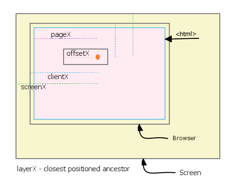

- [W3C: Events](http://www.w3.org/TR/2000/REC-DOM-Level-2-Events-20001113/events.html)
- [W3C: Event Interface](http://www.w3.org/TR/2000/REC-DOM-Level-2-Events-20001113/events.html#Events-Event)
- [W3C: UIEvent Interface](http://www.w3.org/TR/2000/REC-DOM-Level-2-Events-20001113/events.html#Events-UIEvent)
- [QuirkModes: Events Properties](http://www.quirksmode.org/js/events_properties.html)
- [Cross-browser mouse positioning](http://www.jacklmoore.com/notes/mouse-position/)


[Javascript: Which events do not bubble?](http://stackoverflow.com/questions/5574207/javascript-which-events-do-not-bubble)

和发生事件的元素紧密相关的事件不会冒泡，比如：
submit, focus, blur, load, unload, change, reset, scroll
大多数DOM events(DOMFocusIn, DOMFocusOut, DOMNodeRemoved)不会冒泡，比如 mouseenter, mouseleave
所以在实现时间代理的时候要对这些事件做特殊处理。做事件监听时要监听捕获阶段。

=================================



助记: 看上图，想象一个显示其屏幕上显示着一个浏览器，浏览器里面有一个页面，你点击了页面中的某个元素

坐标都是相对，针对不同的原点，每个鼠标事件都一组不同的坐标：

从外往里：
- **screenX**/Y : 如果原点是**显示器左上角**
- **clientX**/Y : 如果原点是**视口**: (因为视口是浏览器Window的Client区域，所以这里叫做clientX/Y)
- **pageX**/Y   : 如果原点是**文档元素** : (文档->页面-> web page)
- **layerX**/Y  : 如果原点是**positioned ancestor element**: (因为position的元素会被放到不同layer，有z-index)
- **offsetX**/Y : 如果原点是**产生鼠标事件的对象**: (相对于点击对象的偏移量-> offset)

只有前两个是W3C标准中的。因为前两个都与文档无关，只和操作系统GUI相关，简单不容易有不同的理解。
而剩下的几个进入到文档文档中，和浏览器对文档的解释紧密相关，所以这些属性浏览器之间差异较大。

------------------------

*Mouse Event Properties*
------------------------

*clientX, clientY* [W3C]
------------------
Standard: W3C Recommendation
Mouse position relative to the browser's **`visible viewport`**.

> *x, y*
------------------------
Standard: W3C Working Draft
Equivalent to clientX, clientY, but is unsupported by some browsers. Use clientX, clientY instead.

*screenX, screenY* [W3C]
------------------------
Standard: W3C Recommendation
Mouse position relative to the user's physical **`screen`**.

*offsetX, offsetY* [Calculation needed]
------------------------
Standard: W3C Working Draft
Mouse position relative to the `target element`. This is implemented very __inconsistently__ between browsers.

*pageX, pageY* [Calculation needed]
------------------------
Standard: W3C Working Draft
Mouse position relative to the html `document` (ie. [layout viewport](http://www.quirksmode.org/mobile/viewports2.html)).

*layerX, layerY* [Calculation needed]
------------------------
No Standard
Mouse position relative to the closest positioned ancestor element. If none of the ancestor elements have positioning, the mouse position is relative to the document (like pageX, pageY). LayerX, layerY have an [uncertain future](https://bugs.webkit.org/show_bug.cgi?id=21868#c21).

QuirksMode has a great [compatibility table](http://www.quirksmode.org/dom/w3c_cssom.html#mousepos) that details inconsistencies in the non-standard properties. 
**Know that only clientX, clientY, screenX, and screenY are part of the W3C Spec**.

Normalization
=============

Calculating offsetX, offsetY
----------------------------

According to the W3C Working Draft, offsetX and offsetY should be relative to the padding edge of the target element. The only browser using this convention is IE. Webkit uses the border edge, Opera uses the content edge, and FireFox does not support the properties.

Normalizing to the border edge is easiest to do, thanks to the nifty element.getBoundingClientRect:

```javascript
document.body.onclick = function(e) {
    e = e || window.event;

    var target = e.target || e.srcElement,
        rect = target.getBoundingClientRect(),
        //鼠标事件距离视口水平距离 - target左边框距离视口书评距离
        offsetX = e.clientX - rect.left, 
        offsetY = e.clientY - rect.top;

    console.log([offsetX, offsetY]);
};
```


If you wanted to normalize to the W3C draft spec, then the border width needs to be subtracted from the previously calculated offsetX and offsetY:

```javascript
document.body.onclick = function(e) {
    e = e || window.event;

    var target = e.target || e.srcElement,
        style = target.currentStyle || window.getComputedStyle(target, null),
        borderLeftWidth = parseInt(style['borderLeftWidth'], 10),
        borderTopWidth = parseInt(style['borderTopWidth'], 10),
        rect = target.getBoundingClientRect(),
        //W3C：鼠标事件距离视口水平距离 - target左边框距离视口书评距离 - 左边框宽
        offsetX = e.clientX - borderLeftWidth - rect.left,
        offsetY = e.clientY - borderTopWidth - rect.top;

    console.log([offsetX, offsetY]);
};
```


Calculating pageX, pageY
------------------------

The only major browser that does not support these properties is IE8. If you are doing event handling with jQuery, it will automatically normalize pageX and pageY for you. If you are not using jQuery's normalized events but still have access to the jQuery, you can use jQuery.event.fix to normalize the event object. Example:

```javascript
document.body.onclick = function(e) {
    e = e || window.event;
    e = jQuery.event.fix(e);
    console.log([e.pageX, e.pageY]);
};
```

Without jQuery, the clientX and clientY properties can be added to the viewports scrollLeft and scrollTop to calculate the pageX and pageY values. see also [QuirksMode: Event properties](http://www.quirksmode.org/js/events_properties.html)

```javascript
document.body.onclick = function(e) {
    e = e || window.event;

    var pageX = e.pageX;
    var pageY = e.pageY;
    if (pageX === undefined) {
        pageX = e.clientX + document.body.scrollLeft + document.documentElement.scrollLeft;
        pageY = e.clientY + document.body.scrollTop + document.documentElement.scrollTop;
    }

    console.log([pageX, pageY]);
};
```

[Calculate LayerX/Y](http://stackoverflow.com/questions/8389156/what-substitute-should-we-use-for-layerx-layery-since-they-are-deprecated-in-web)
--------------------

> I renamed the function from `getOffset` to `getLayerXY`

```javascript
function getLayerXY(evt) {
  var el = evt.target,
      x = y = 0;

  while (el && !isNaN(el.offsetLeft) && !isNaN(el.offsetTop)) {
    x += el.offsetLeft - el.scrollLeft;
    y += el.offsetTop - el.scrollTop;
    el = el.offsetParent;
  }

  x = evt.clientX - x;
  y = evt.clientY - y;

  return { x: x, y: y };
}
```

Events Object Normalization
---------------------------

```javascript
var EventUtil = {
    hasFeatureMouseEvents2: document.implementation.hasFeature('MouseEvents','2.0'),
    addHandler: function(ele,type,handler){
        //DOM2->IE->DOM0
        if(ele.addEventListener){
            ele.addEventListener(type,handler,false);
        } else if(ele.attachEvent){
            ele.attachEvent('on' + type, handler);
        } else {
            ele['on' + type] = handler;
        }
    },
    removeHandler: function(ele,type,handler){
        if(ele.removeEventListener){
            ele.removeEventListener(type,handler,false);
        } else if(ele.detachEvent){
            ele.detachEvent('on' + type,handler);
        } else {
            ele['on' + type] = null;
        }
    },
    getEvent: function(e){
        return e ? e : window.event;
    },
    getTarget: function(e){
        return e.target || e.srcElement;
    },
    preventDefault: function(e){
        if(e.preventDefault){
            e.preventDefault();
        } else {
            e.returnValue = false;
        }
    },
    stopPropagation: function(e){
        if(e.stopPropagation){
            e.stopPropagation();
        } else {
            e.cancelBubble = true;
        }
    },
    getRelatedTarget: function(e){
        if(e.relatedTarget){
            return e.relatedTarget;
        } else if(e.toElement){
            return e.toElement;
        } else if(e.fromElement){
            return e.fromElement;
        } else {
            return null;
        }
    },
    getButton: function(e){
        if(this.hasFeatureMouseEvents2){
            return e.button;
        } else {
            switch(e.button){
                case 0:
                case 1:
                case 3:
                case 5:
                case 7:
                    return 0;
                case 2:
                case 6:
                    return 2;
                case 4:
                    return 1;
            }
        }
    },
    getCharCode: function(e){
        if(typeof e.charCode == 'number'){
            return e.charCode;
        } else {
            return e.keyCode;
        }
    }
};
```
