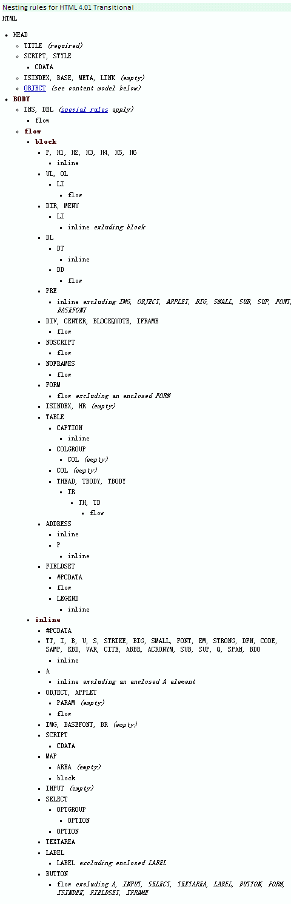

`<p>`标签中只能包含行级元素
===========================

遇到块级元素时会终止解析，自动加上结束标签

```html
<p>
  hello
  <div>world!</div>
</p>
```
会被解析为

```html
<p>
  hello
  </p><div>world!</div>
<p></p>
```

HTML 4 DTD:
[9.3.1 Paragraphs: the P element](http://www.w3.org/TR/html401/struct/text.html#h-9.3.1)

```
<!ELEMENT P - O (%inline;)*            -- paragraph -->
```

下面是一个比较完整的[包含规则](http://www.cs.tut.fi/~jkorpela/html/nesting.html)：



