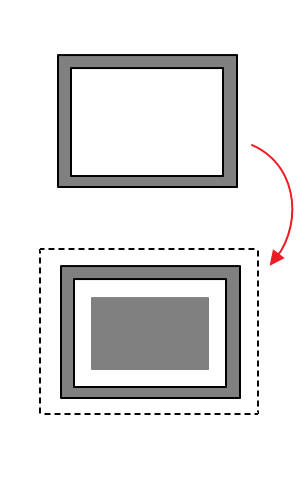
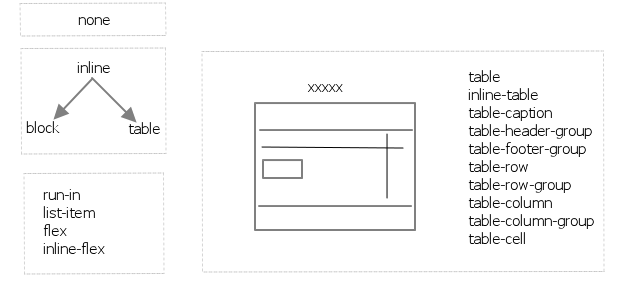

画出盒式模型
============
[http://www.w3.org/TR/CSS2/box.html](http://www.w3.org/TR/CSS2/box.html)


W3C和IE对盒模型不同的解释
----


★[来源]([http://en.wikipedia.org/wiki/Internet_Explorer_box_model_bug)

助记:



- IE5.5以及以前的版本的IE使用IE盒模型。IE6在standards compliant mode会使用W3C的盒模型
- css3引入了控制盒模型的属性：`box-sizing = [border-box|content-box|padding-box|inherit]`


display有哪些属性
=================

```css
display: [
  inline
  | block
  | none
  | inline-block
  
  | table
  | inline-table
  | table-caption
  | table-header-group
  | table-footer-group
  | table-row
  | table-row-group
  | table-column
  | table-column-group
  | table-cell
  
  | run-in
  | list-item
  | inherit
  
  | flex
  | inline-flex
]
```

助记: 

另外：为什么display有这么多table-开头的值呢？
★★★[css spec table](http://www.w3.org/TR/CSS21/tables.html#table-display)

> The CSS table model is based on the HTML4 table model, in which the structure of a table closely parallels the visual layout of the table. In this model, a table consists of an optional caption and any number of rows of cells. The table model is said to be "row primary" since authors specify rows, not columns, explicitly in the document language. Columns are derived once all the rows have been specified -- the first cell of each row belongs to the first column, the second to the second column, etc.). Rows and columns may be grouped structurally and this grouping reflected in presentation (e.g., a border may be drawn around a group of rows).
Thus, the table model consists of **tables, captions, rows, row groups (including header groups and footer groups), columns, column groups, and cells**.
**The CSS model does not require that the document language include elements that correspond to each of these components. For document languages (such as XML applications) that do not have pre-defined table elements, authors must map document language elements to table elements; this is done with the 'display' property**. 

```
table    { display: table }
tr       { display: table-row }
thead    { display: table-header-group }
tbody    { display: table-row-group }
tfoot    { display: table-footer-group }
col      { display: table-column }
colgroup { display: table-column-group }
td, th   { display: table-cell }
caption  { display: table-caption
```


写一个三栏式布局
================

★★★★★先介绍css3 Flexbox
[A Complete Guide to Flexbox](http://css-tricks.com/snippets/css/a-guide-to-flexbox/)

使用Flexbox可以轻松做出三栏布局
传统的三栏布局用margin来调整div的位置就可以了


position有哪些可选值
==================

`position : [static|absolute|relative|fixed|inherit]`

注意：float不是position的可取值，而是一个css属性

float有哪些可选值
=================

`float : [left|right]`

有哪些css选择符
===============
```
Universal selector
Type selectors
Descendant selectors
Child selectors
Ajacent sibling selectors
Attribute selectors
ID selectors
Pseudo-elements/classes
```

助记:`Put Cai AD` `放菜广告`
注意：有两个A，Ajacent和Attribute；将AD及一位Ajacent和Descendant，都是表示关系的。

